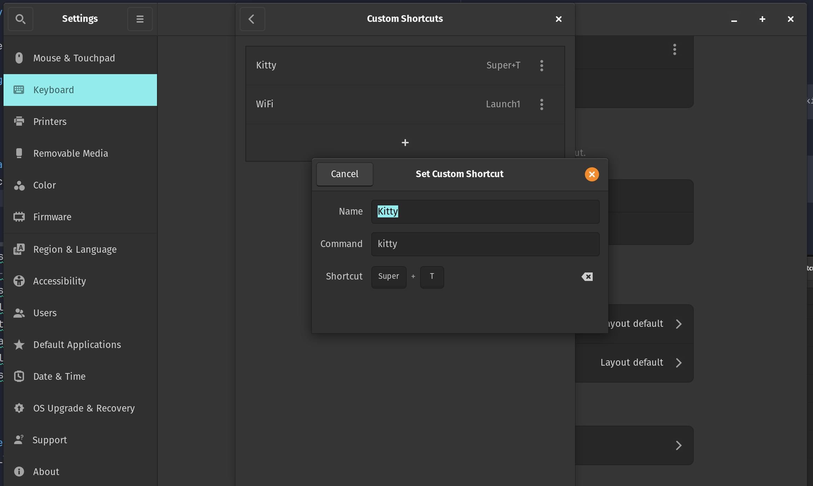

# 🛠 My Dotfiles & Package Management

This repository contains my dotfiles and configuration management using `stow`. It also documents how I installed and update my essential CLI tools using Homebrew.

---

## 📦 Installed Packages

### HomeBrew

I use **Homebrew** as my package manager for installing CLI tools. Below is a list of packages currently installed on my system:

- **lazydocker** → Installed via:
  ```sh
  brew install lazydocker
- **yarn** → Installed via:
  ```sh
  brew install yarn
- **yazi** → Installed via:
  ```sh
  brew install yazi
  
### Kitty
kitty (terminal emulator) → Installed via Cosmic Store
#### Install flathub
```bash
  flatpak install flathub
```
#### Install Kitty
- Install Kitty from Cosmic Store
#### Grant access to your dotfiles
```bash
flatpak override --user io.kitty.Kitty --filesystem=~/.config/kitty:ro
```
#### Link Kitty Configs (Need to have dotfiles repo first)
```bash
cd ~/dotfiles
stow kitty
```
#### Set kitty as default for Win+t
- Open keyboard shortcuts > Custom shortcuts and kitty
- 

### Snap
| Package       | Install Command                             |
|---------------|---------------------------------------------|
| datagrip | snap install datagrip --classic             |
| nvim | Csnap install nvim --classic                |
| pycharm-professional | snap install pycharm-professional --classic |
| rider | snap install rider --classic                |
| rubymine | snap install rubymine --classic             |

---

## 🔄 Updating Homebrew & Packages
- To ensure all installed packages are up-to-date, I run:
   ```sh
   brew update && brew upgrade

- To upgrade a specific package:
   ```sh
    brew upgrade <package-name>

- To check if any packages are outdated:
   ```sh
    brew outdated

---

## ❌ Uninstalling a Package
- To remove a package installed via Homebrew:
   ```sh
    brew uninstall <package-name>

---

## 🛠 Managing Dotfiles with GNU Stow
I use GNU Stow to manage my configuration files in a structured way.

### 📌 Structure
I then use stow to create symlinks for specific applications:
```
stow lazydocker
stow yarn
stow yazi
stow kitty
```
This automatically symlinks the configurations from ~/.dotfiles/ into the corresponding locations inside ~/.config/.

---

## 🔥 Removing a Dotfile Symlink
If I want to remove a dotfile symlink:
```sh
  stow -D <package>
```
---

## 🦊 Installing & Managing Firefox Developer Edition
Firefox Developer Edition is not available in most package managers or app stores, so I manually downloaded and installed it.
### 📥 Installation Process

1. **Download the latest Firefox Developer Edition tarball from the official website**:
   ```sh
   wget -O /opt/firefox-developer.tar.bz2 "https://download.mozilla.org/?product=firefox-devedition-latest-ssl&os=linux64&lang=en-US"
2. **Extract the tarball into /opt/:**
   ```sh
    sudo tar -xjf /opt/firefox-developer.tar.bz2 -C /opt/
3. **Rename the extracted folder (if needed) for consistency:**
   ```sh
    sudo mv /opt/firefox /opt/firefox-developer
4. **Create a symlink in /usr/local/bin/ for easy execution:**
   ```sh
    sudo ln -sf /opt/firefox-developer/firefox /usr/local/bin/firefox-developer
5. **Launch Firefox Developer Edition**:
   ```sh
    firefox-developer

### ❌ Uninstalling Firefox Developer Edition
- To completely remove Firefox Developer Edition from my system:
   ```sh
  sudo rm -rf /opt/firefox-developer
  sudo rm -f /opt/firefox-developer.tar.bz2
  sudo rm -f /usr/local/bin/firefox-developer
