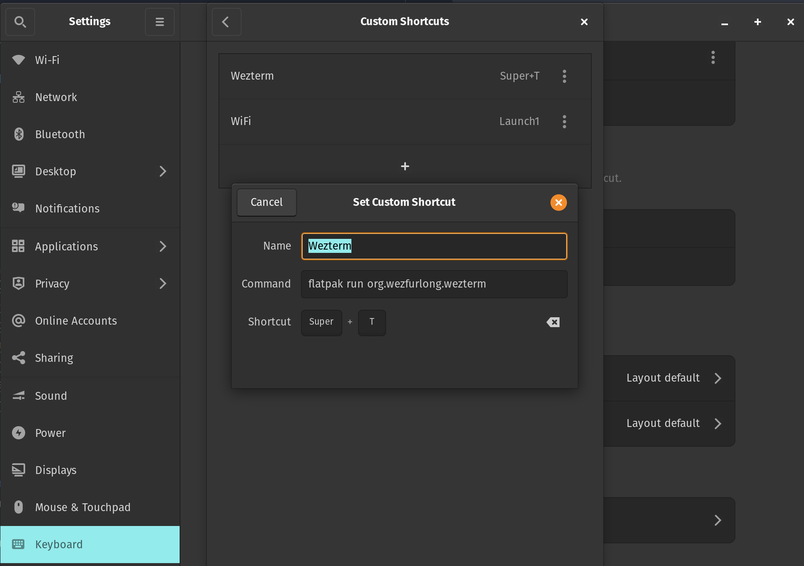

# 🛠 My Dotfiles & Package Management

This repository contains my dotfiles and configuration management using `stow`. It also documents how I installed and update my essential CLI tools using Homebrew.

---

## 📦 Installed Packages

### HomeBrew

I use **Homebrew** as my package manager for installing CLI tools. Below is a list of packages currently installed on my system:

- **lazydocker** → Installed via:
  ```sh
  brew install lazydocker
- **yarn** → Installed via:
  ```sh
  brew install yarn
- **yazi** → Installed via:
  ```sh
  brew install yazi
  
### Wezterm
Wezterm (terminal emulator) → Installed via Cosmic Store
#### Install flathub
```bash
  flatpak install flathub
```
#### Install Wezterm
- Install Wezterm from Cosmic Store

#### Link Wezterm Configs (Need to have dotfiles repo first)
```bash
cd ~/dotfiles
stow wezterm
```
#### Set Wezterm as default for Win+t
- Open keyboard shortcuts > Custom shortcuts and kitty
  - Name : ```Wezterm```
  - Command : ```flatpak run org.wezfurlong.wezterm```
- 

### Snap
| Package       | Install Command                             |
|---------------|---------------------------------------------|
| datagrip | snap install datagrip --classic             |
| nvim | snap install nvim --classic                |
| pycharm-professional | snap install pycharm-professional --classic |
| rider | snap install rider --classic                |
| rubymine | snap install rubymine --classic             |

### Kitty
Kitty (terminal emulator) → Installed via snap or system package manager:
```sh
sudo apt install kitty
```
#### Link Kitty Configs
```bash
cd ~/dotfiles
stow kitty
```

### Neovim
Neovim → Installed via snap (see Snap table above).
#### Link Neovim Configs
```bash
cd ~/dotfiles
stow nvim
```
Config uses [lazy.nvim](https://github.com/folke/lazy.nvim) as the plugin manager, with Treesitter and LSP (ESLint, Prettier) configured.

---

## 🔄 Updating Homebrew & Packages
- To ensure all installed packages are up-to-date, I run:
   ```sh
   brew update && brew upgrade

- To upgrade a specific package:
   ```sh
    brew upgrade <package-name>

- To check if any packages are outdated:
   ```sh
    brew outdated

---

## ❌ Uninstalling a Package
- To remove a package installed via Homebrew:
   ```sh
    brew uninstall <package-name>

---

## 🛠 Managing Dotfiles with GNU Stow
I use GNU Stow to manage my configuration files in a structured way.

### 📌 Structure
I then use stow to create symlinks for specific applications:
```
stow lazydocker
stow yarn
stow yazi
stow kitty
stow wezterm
stow nvim
stow zsh
```
This automatically symlinks the configurations from `~/dotfiles/` into the corresponding locations inside `~/.config/` (and `~` for dotfiles like `.zshrc`).

---

## 🔥 Removing a Dotfile Symlink
If I want to remove a dotfile symlink:
```sh
  stow -D <package>
```
---

## 🦊 Installing & Managing Firefox Developer Edition
Firefox Developer Edition is not available in most package managers or app stores, so I manually downloaded and installed it.
### 📥 Installation Process

1. **Download the latest Firefox Developer Edition tarball from the official website**:
   ```sh
   wget -O /opt/firefox-developer.tar.bz2 "https://download.mozilla.org/?product=firefox-devedition-latest-ssl&os=linux64&lang=en-US"
2. **Extract the tarball into /opt/:**
   ```sh
    sudo tar -xjf /opt/firefox-developer.tar.bz2 -C /opt/
3. **Rename the extracted folder (if needed) for consistency:**
   ```sh
    sudo mv /opt/firefox /opt/firefox-developer
4. **Create a symlink in /usr/local/bin/ for easy execution:**
   ```sh
    sudo ln -sf /opt/firefox-developer/firefox /usr/local/bin/firefox-developer
5. **Launch Firefox Developer Edition**:
   ```sh
    firefox-developer

### ❌ Uninstalling Firefox Developer Edition
- To completely remove Firefox Developer Edition from my system:
   ```sh
  sudo rm -rf /opt/firefox-developer
  sudo rm -f /opt/firefox-developer.tar.bz2
  sudo rm -f /usr/local/bin/firefox-developer

---

## 🐚 Zsh
Shell configuration managed via [Oh My Zsh](https://ohmyzsh.com) with the following setup:
- **Prompt**: Oh My Posh (`multiverse-neon` theme)
- **Plugins**: `git`, `zsh-autosuggestions`, `fast-syntax-highlighting`
- **Tools integrated**: NVM, rbenv, RVM, fzf, Homebrew, .NET SDK, Rust (cargo)
- **Notable aliases**: `vi` → nvim, `ls` → lsd, `bat` → batcat, `ldo` → lazydocker, `y` → yazi (with cwd-tracking)

#### Link Zsh Config
```bash
cd ~/dotfiles
stow zsh
```

---

## 🤖 Claude Code

Claude Code CLI configuration managed via stow.

**Tracked files:**
- `settings.json` — main settings (model, status line, permissions)
- `keybindings.json` — custom keybindings
- `statusline-command.sh` — status line script
- `skills/` — custom skills

**Not tracked** (machine-specific or sensitive): `.credentials.json`, `history.jsonl`, `sessions/`, `projects/`, `settings.local.json`

#### Link Claude Configs
```bash
cd ~/dotfiles
stow claude
```

---

## 🗂 Yazi
Yazi (terminal file manager) → Installed via Homebrew (see above). Config uses the **Catppuccin Frappé** flavor.

#### Link Yazi Configs
```bash
cd ~/dotfiles
stow yazi
```
