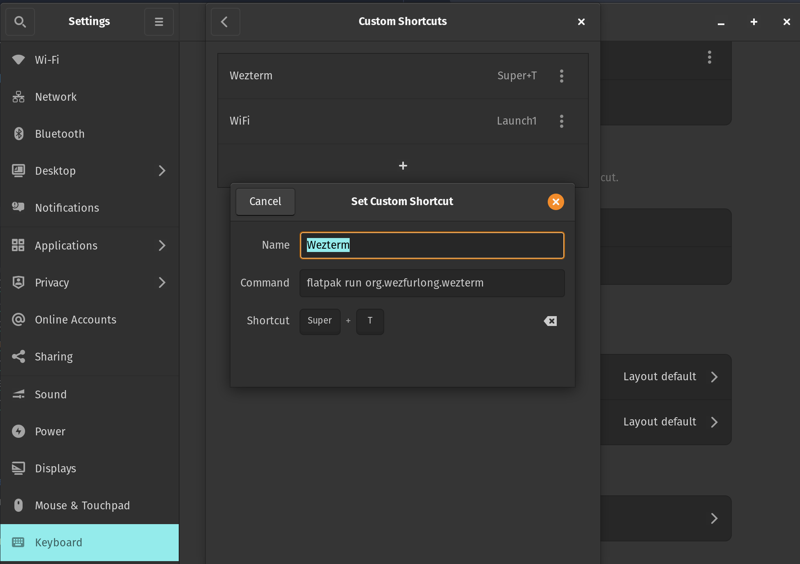

# 🛠 My Dotfiles & Package Management

This repository contains my dotfiles and configuration management using `stow`. It also documents how I installed and update my essential CLI tools using Homebrew.

---

## 📦 Installed Packages

### HomeBrew

I use **Homebrew** as my package manager for installing CLI tools. Below is a list of packages currently installed on my system:

- **lazydocker** → Installed via:
  ```sh
  brew install lazydocker
- **yarn** → Installed via:
  ```sh
  brew install yarn
- **yazi** → Installed via:
  ```sh
  brew install yazi
  
### Wezterm
Wezterm (terminal emulator) → Installed via Cosmic Store
#### Install flathub
```bash
  flatpak install flathub
```
#### Install Wezterm
- Install Wezterm from Cosmic Store

#### Link Wezterm Configs (Need to have dotfiles repo first)
```bash
cd ~/dotfiles
stow wezterm
```
#### Set Wezterm as default for Win+t
- Open keyboard shortcuts > Custom shortcuts and kitty
  - Name : ```Wezterm```
  - Command : ```flatpak run org.wezfurlong.wezterm```
- 

#### Alt+1 conflict with Neovim
WezTerm binds `ALT+1`–`ALT+8` to `ActivateTab` **by default**. Assigning `config.keys` adds to
those defaults rather than replacing them, so `Alt+1` never reaches Neovim — which the LazyVim
config maps to the Snacks file explorer. To let it through, add to `keys.lua`:
```lua
{
    key = '1',
    mods = 'ALT',
    action = wezterm.action.SendKey { key = '1', mods = 'ALT' },
},
```
Alternatively bind a different key in Neovim, or set
`config.disable_default_key_bindings = true` and re-declare the bindings worth keeping.

### Snap
| Package       | Install Command                             |
|---------------|---------------------------------------------|
| datagrip | snap install datagrip --classic             |
| nvim | snap install nvim --classic                |
| pycharm-professional | snap install pycharm-professional --classic |
| rider | snap install rider --classic                |
| rubymine | snap install rubymine --classic             |

### Kitty
Kitty (terminal emulator) → Installed via snap or system package manager:
```sh
sudo apt install kitty
```
#### Link Kitty Configs
```bash
cd ~/dotfiles
stow kitty
```

### Neovim
Neovim → Installed via snap (see Snap table above). Requires **0.11.2+**; the snap tracks a
current release (0.12.x), which the Ubuntu apt package (0.9.5) does not satisfy.

#### Link Neovim Configs
```bash
cd ~/dotfiles
stow nvim
```

Config is [LazyVim](https://lazyvim.org) on top of
[lazy.nvim](https://github.com/folke/lazy.nvim), with **Catppuccin Mocha** as the colorscheme.
`lazy-lock.json` is tracked, so plugin revisions are reproducible across machines.

**Layout:**
```
nvim/.config/nvim/
├── lazyvim.json            # which LazyVim extras are enabled
├── lsp/easy_dotnet.lua     # Roslyn inlay hints + Neovim file watching
├── after/ftplugin/cs.lua   # C#: 4-space indent, no format-on-save
└── lua/
    ├── config/             # options, keymaps, lazy bootstrap
    └── plugins/            # dotnet, markdown, python, personal (theme/lualine/gitsigns)
```

**Enabled extras:** `lang.typescript`, `lang.python`, `lang.json`, `lang.yaml`,
`lang.markdown`, `linting.eslint`, `formatting.prettier`, `dap.core`, `test.core`.

**Deliberate exclusions** — do not re-add without reason: OmniSharp (EasyDotnet's Roslyn is
used instead), `neotest-vstest`, Marksman, `markdownlint-cli2`, and
`markdown-preview.nvim` (vulnerable Socket.IO dependency tree).

#### External tooling this config expects
`ripgrep`, `fd`, `fzf`, `lazygit`, a C compiler (`build-essential`), Node LTS, Python 3 +
venv, and the .NET SDK. Language servers and formatters are managed by Mason, not installed
globally. The C#/Blazor profile additionally uses two global .NET tools:
```bash
dotnet tool install -g easydotnet
dotnet tool install -g roslyn-language-server --prerelease
```

> **Note:** WezTerm binds `Alt+1`–`Alt+8` to tab switching by default, which swallows the
> `<M-1>` file-explorer mapping in this config. Setting `config.keys` does not disable
> WezTerm's defaults — see the Alt+1 note in the WezTerm section.

---

## 🔄 Updating Homebrew & Packages
- To ensure all installed packages are up-to-date, I run:
   ```sh
   brew update && brew upgrade

- To upgrade a specific package:
   ```sh
    brew upgrade <package-name>

- To check if any packages are outdated:
   ```sh
    brew outdated

---

## ❌ Uninstalling a Package
- To remove a package installed via Homebrew:
   ```sh
    brew uninstall <package-name>

---

## 🛠 Managing Dotfiles with GNU Stow
I use GNU Stow to manage my configuration files in a structured way.

### 📌 Structure
I then use stow to create symlinks for specific applications:
```
stow lazydocker
stow yarn
stow yazi
stow kitty
stow wezterm
stow nvim
stow zsh
```
This automatically symlinks the configurations from `~/dotfiles/` into the corresponding locations inside `~/.config/` (and `~` for dotfiles like `.zshrc`).

---

## 🔥 Removing a Dotfile Symlink
If I want to remove a dotfile symlink:
```sh
  stow -D <package>
```
---

## 🦊 Installing & Managing Firefox Developer Edition
Firefox Developer Edition is not available in most package managers or app stores, so I manually downloaded and installed it.
### 📥 Installation Process

1. **Download the latest Firefox Developer Edition tarball from the official website**:
   ```sh
   wget -O /opt/firefox-developer.tar.bz2 "https://download.mozilla.org/?product=firefox-devedition-latest-ssl&os=linux64&lang=en-US"
2. **Extract the tarball into /opt/:**
   ```sh
    sudo tar -xjf /opt/firefox-developer.tar.bz2 -C /opt/
3. **Rename the extracted folder (if needed) for consistency:**
   ```sh
    sudo mv /opt/firefox /opt/firefox-developer
4. **Create a symlink in /usr/local/bin/ for easy execution:**
   ```sh
    sudo ln -sf /opt/firefox-developer/firefox /usr/local/bin/firefox-developer
5. **Launch Firefox Developer Edition**:
   ```sh
    firefox-developer

### ❌ Uninstalling Firefox Developer Edition
- To completely remove Firefox Developer Edition from my system:
   ```sh
  sudo rm -rf /opt/firefox-developer
  sudo rm -f /opt/firefox-developer.tar.bz2
  sudo rm -f /usr/local/bin/firefox-developer

---

## 🐚 Zsh
Shell configuration managed via [Oh My Zsh](https://ohmyzsh.com) with the following setup:
- **Prompt**: Oh My Posh (`multiverse-neon` theme)
- **Plugins**: `git`, `zsh-autosuggestions`, `fast-syntax-highlighting`
- **Tools integrated**: NVM, rbenv, RVM, fzf, Homebrew, .NET SDK, Rust (cargo)
- **Notable aliases**: `vi` → nvim, `ls` → lsd, `bat` → batcat, `ldo` → lazydocker, `y` → yazi (with cwd-tracking)

#### Link Zsh Config
```bash
cd ~/dotfiles
stow zsh
```

---

## 🤖 Claude Code

Claude Code CLI configuration managed via stow.

**Tracked files:**
- `settings.json` — main settings (model, status line, permissions)
- `keybindings.json` — custom keybindings
- `statusline-command.sh` — status line script
- `skills/` — custom skills

**Not tracked** (machine-specific or sensitive): `.credentials.json`, `history.jsonl`, `sessions/`, `projects/`, `settings.local.json`

#### Link Claude Configs
```bash
cd ~/dotfiles
stow claude
```

---

## 🗂 Yazi
Yazi (terminal file manager) → Installed via Homebrew (see above).

**Tracked files:**
- `theme.toml` — sets the dark flavor to **Catppuccin Mocha**
- `package.toml` — flavor dependency, managed by `ya pkg` (`yazi-rs/flavors:catppuccin-mocha`)
- `flavors/catppuccin-mocha.yazi/` — the vendored flavor package itself
- `yazi.toml`, `keymap.toml` — stock upstream defaults, kept in-repo so the config is self-contained

Since `yazi.toml`/`keymap.toml` are unmodified defaults, the notable behaviour is all upstream: 1:4:3 pane ratio, alphabetical case-insensitive sort with directories first, hidden files off, vim-style navigation, `z`/`Z` for zoxide/fzf jumps, `s`/`S` to search by name (fd) or content (ripgrep).

#### Link Yazi Configs
```bash
cd ~/dotfiles
stow yazi
```

#### Shell Integration
`.zshrc` defines a `y` function that wraps yazi with `--cwd-file`, so quitting drops the shell in the last directory you browsed.

#### Changing the Flavor
```bash
ya pkg add yazi-rs/flavors:<name>   # fetch into flavors/
```
Then point `theme.toml` at it:
```toml
[flavor]
dark = "<name>"
```
